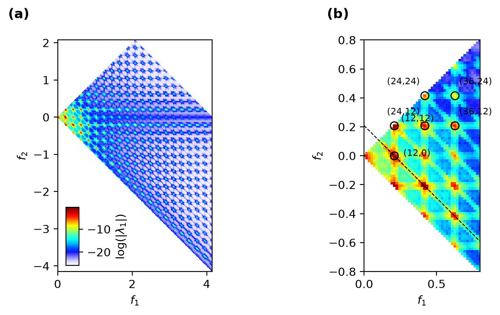

# Cylinder Wake Mode Bispectrum

`docs/build_cylinder_figure.py` reproduces the cylinder-wake mode-bispectrum figure from Schmidt
(2020, *Nonlinear Dynamics*), `refs/figures/cylinder_bispectrum_sumdiff.pdf`, with PyBMD on the
`refs/bmd/wake_Re500.mat` dataset (the `refs/bmd` git submodule).

```bash
git submodule update --init
MPLBACKEND=Agg python docs/build_cylinder_figure.py
```



## How the reference parameters were recovered

Nothing in the repo generates this figure -- there is no "sumdiff" script anywhere, and
`refs/bmd/example1.m` only draws an interactive, index-labelled version on the fly. The reference
PDF itself was rasterized at 400 dpi and measured directly (pcolor cell pitch, axis extents, marker
positions, colorbar ticks) to recover the parameters it was produced with:

- panel (a) spans `xlim=[0, f(end)]`, `ylim=[-f(end), f(end)/2]` with `f(end) = 8.316`, i.e.
  `df = 1/57.6 = 0.017361`;
- panel (b) zooms to `[0, 0.8] x [-0.8, 0.8]` and circles six triads at multiples of
  `12 df = 0.2083`: `(12,12)`, `(12,0)`, `(24,12)`, `(24,24)`, `(36,12)`, `(36,24)`.

Matching `df = 0.017361` requires `dt = 0.06`, `n_dft = 960` -- twice the time resolution of the
`wake_Re500.mat` shipped here (`dt = 0.12`, `nt = 1024`). The shipped file is that same dataset,
subsampled 2x in time over the same total duration (`nt * dt = 122.88` either way). Consequently:

- **`n_dft = 480` at `dt = 0.12` reproduces the reference's exact frequency grid.** Verified with
  `pybmd.bmd.utils.triad_indices`: all six labelled triads exist in `regions=[1, 2]` at exactly the
  physical frequencies the reference marks them at, e.g. `(12,12,24)` -> `{0.2083, 0.2083, 0.4167}`.
- The dataset's own vortex-shedding frequency, measured from a zero-padded spectrum of `v`, is
  `f0 = 0.2074` (harmonics at 0.4145, 0.6225, 0.8302) `= 11.94 df`, i.e. index **12** -- which is
  why the reference labels the fundamental triad `(12,12,24)`.

Two differences from the published panel are unavoidable given the shipped (subsampled) data, and
are not attempts to hide a bug:

1. **Panel (a)'s extent is halved** -- `[0, 4.15] x [-4.15, 2.07]` instead of `[0, 8.32] x
   [-8.32, 4.16]` -- because the Nyquist frequency halves when the sampling rate halves at fixed
   `nt * dt`. Same picture, half the plane.
2. **3 blocks** at the reference's 50% overlap (`n_overlap = 240`), against presumably more in the
   original full-rate dataset, so the non-resonant background sits higher and the lattice contrast
   is a little weaker.

The reference's colorbar (jet, with the dark-blue end faded to white) was reproduced by sampling
its pixels directly rather than guessed; see `_CBAR_STOPS` in `build_cylinder_figure.py`.

### Spatial weight: match `bmd.m`'s own default, not a "better" one

`B = Q3^H (Q1*Q2*w)/n_blocks` is linear in the spatial weight `w`, so `log|lambda_1|` (and the
whole colour scale) shifts by a constant depending on which weighting convention is used --
independent of everything above. `refs/bmd/bmd.m:279-281` defaults to `weight = ones(nx,1)`
("uniform") when no weight is passed, and `refs/bmd/example1.m` calls `bmd(u)` with none, so the
published figure was made with a **uniform** weight, not a physically-motivated quadrature one.
Using `pybmd.utils.weights.trapz_2d` instead (a reasonable default for other PyBMD work) shifted
this figure's `[vmin, vmax]` to `[-29.99, -4.49]` against the reference's measured
`[-28.4, +0.37]`; switching to `pybmd.utils.weights.uniform((n1, n2), n_vars=1, dV=1.0)` (matching
`bmd.m`'s default) brings it to `[-25.9, -0.48]`. The residual ~1-in-log gap is consistent with the
reference likely bispectrum-ing `u` and `v` together (`n_variables=2` doubles the flattened
dimension and hence `|lambda_1|` roughly 2x) -- not reproduced here, since the figure only ever
labels a single field.

## What to check when re-running this

The script prints, for each of the six labelled triads, its resolved `(f1, f2, f3)` and `|lambda_1|`,
plus the top 15 triads overall (via `pybmd.bmd.postproc.top_triads`). The acceptance criterion is
physical, not pixel-exact: the labelled triads should sit among the strongest non-trivial
(`k != 0`, `l != 0`) entries, and the global maximum should fall on the shedding lattice (`k`, `l`
multiples of 12) -- exactly as observed:

```
top triads by |lambda_1| (k != 0 and l != 0):
  (24,-12,12)  6.17e-01
  (12, 12,24)  6.11e-01
  (12,-12, 0)  2.29e-01
  ...
```

`(24,-12,12)` is the region-2 mirror of `(12,12,24)` and is expected to be comparably strong.
