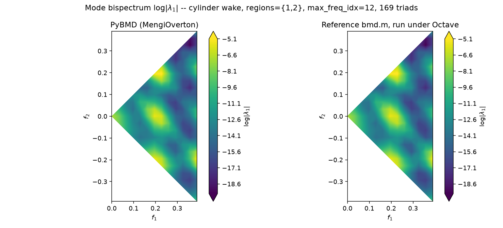
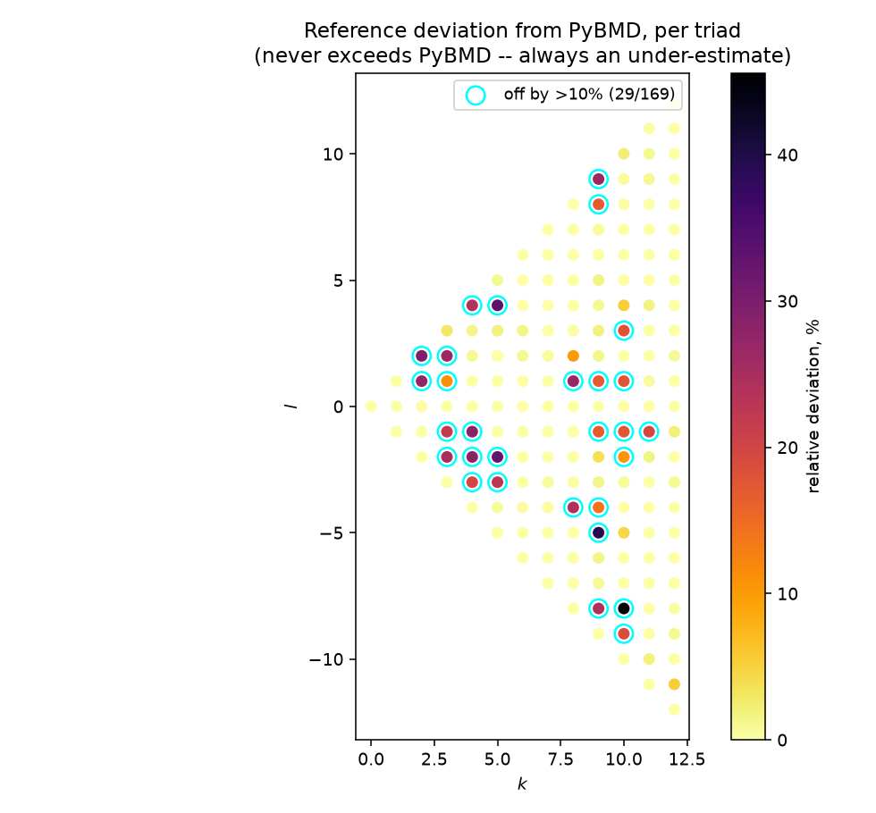
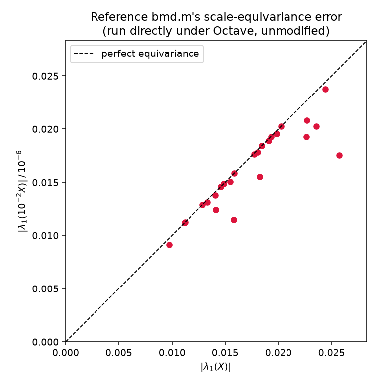
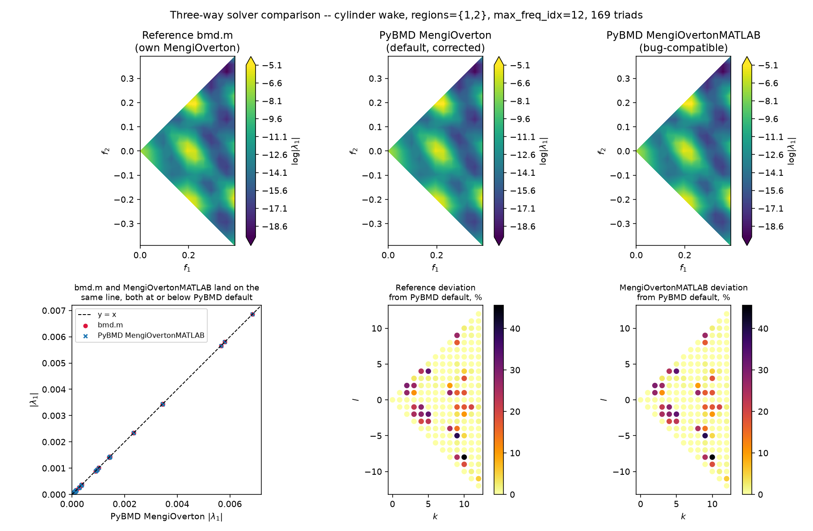
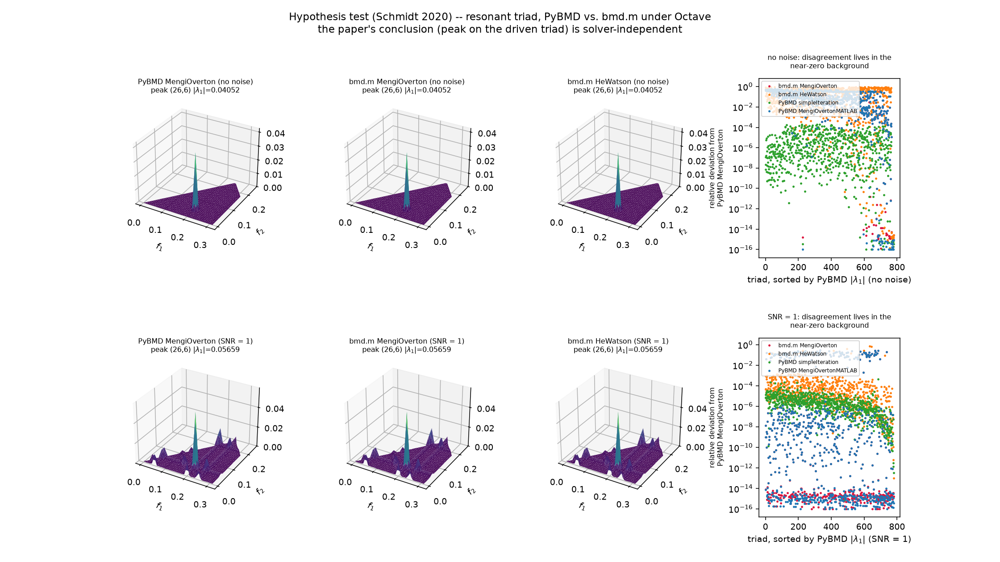

# Octave Cross-Validation

PyBMD is cross-validated against the original MATLAB `bmd.m` and `cbmd.m`
reference implementation by running that code under Octave. The reference is
kept as the `refs/bmd` git submodule rather than vendored into this repository.

The executable regression tests live in `tests/test_octave_reference.py`; this
file records the method those tests are meant to preserve.

## Prerequisites

Run the reference tests with:

```bash
git submodule update --init
pytest tests/test_octave_reference.py -q
```

The tests skip locally when Octave or the submodule is missing. The dedicated
GitHub Actions job sets `PYBMD_REQUIRE_OCTAVE_REF=1`, which turns those missing
prerequisites into failures so the cross-validation job cannot pass vacuously.

## Fairness Rules

- The Octave reference is run unmodified for end-to-end comparisons.
- Tier A uses an instrumented copy in a temporary directory, never by editing
  `refs/bmd/*.m`. The copy only exposes `Q_hat` and each per-triad `B`.
- Inputs are cast to double precision before writing the `.mat` files.
- PyBMD's C-order spatial flattening is applied before the data reaches Octave.
  The weights are flattened in the same order, so MATLAB's column-major `(:)`
  never gets to choose a different spatial permutation.
- BMD data is passed as `(nt, nxv)` to Octave. CBMD data is passed as
  `(nt, n_variables, nx)`, matching `cbmd.m` while preserving PyBMD's variables
  last convention at the Python boundary.
- The same window, overlap in snapshots, `dt`, regions, `nfreq`, solver
  tolerance, and iteration cap are passed to both implementations.

## Test Tiers

Tier A checks DFT, blocking, weighting, and triad construction. It compares
PyBMD's `Q_hat` rows and every per-triad `B` matrix against the instrumented
reference with relative tolerance `1e-12`. This is the strictest and most
important language-boundary check.

Tier B checks mode assembly and the energy-transfer term `T` against the
unmodified reference, but only on triads whose solver result already agrees.
This intentionally isolates mode normalization and `T` from known numerical
radius solver differences.

Tier C checks the numerical-radius solver on identical `B` matrices. PyBMD's
Mengi-Overton result is compared against an independent angular scan with local
refinement with relative tolerance `5e-7`, and the reference result is required
not to exceed PyBMD's result beyond a `1e-8` relative guard.
On the full cylinder-wake fixture with `regions=[1, 2]` and `max_freq_idx=12`,
the measured reference deviations are pinned at 52/169 triads above 1% and
29/169 triads above 10%, always as under-estimates.

## Evidence: the reference under-estimates, PyBMD doesn't

Side by side on the full cylinder-wake fixture (`regions=[1,2]`, `max_freq_idx=12`, 169 triads),
PyBMD's mode bispectrum and the reference's look qualitatively the same but disagree exactly where
Tier C predicts:



The per-triad relative deviation, mapped onto the `(k,l)` plane, never exceeds PyBMD and is
concentrated where `|λ₁|` is smallest — an under-estimate confined to the weak triads, not a
uniform mismatch:



A correct solver for the numerical radius is exactly scale-equivariant, `r(cA) = c·r(A)`. Running
the unmodified reference on a random case and on a `1e-2` rescale of it shows the reference itself
violating this by up to 32% on this random case — independent confirmation that the fault is in
`bmd.m`'s solver, not in anything PyBMD does to the data before comparing:



## Solver comparison and the MATLAB-compatible solver

### Root cause

The DFT/blocking/weighting stage is not where PyBMD and `bmd.m` disagree: Tier A pins `Q_hat`
and every per-triad `B` to `< 1e-12` relative, and manual line-by-line comparison against
`refs/bmd/bmd.m`/`cbmd.m` confirms the two agree exactly on block indexing, `n_blocks`, the
symmetric Hamming window, the DFT scale `winWeight/n_dft`, the long-time mean, default weights,
`B = Q3^H(Q1∘Q2∘w)/n_blocks`, the unweighted energy-transfer term `T`, the mode normalization, and
the triad map.

**100% of the Tier C disagreement is the numerical-radius solver.** `bmd.m`'s `MengiOverton`
tests unimodularity with `abs(abs(D)-1) <= sqrt(eps)*norm(A,1)` (`bmd.m:403`) — an absolute
tolerance on a dimensionless quantity. Real BMD matrices are tiny (`B` carries `1/n_blocks` and
the spatial weights), so that tolerance collapses, every genuine level-set crossing is rejected,
and the search returns a local value at `theta=0` — always an *under*-estimate. `_pow2_scale`
(deviation 2 in `CLAUDE.md`) removes this, and PyBMD's `MengiOverton` matches a brute-force
angular scan to `< 5e-7` on every triad tested.

### `MengiOvertonMATLAB`: an opt-in, bug-for-bug port

`solver='MengiOvertonMATLAB'` (`pybmd.bmd.optimizers.mengi_overton(..., matlab_compat=True)`)
reverts deviations 1, 2 and 4 (not 3 — it stays RNG-free) and reproduces `bmd.m`'s own
`MengiOverton` instead. It exists **only** to reproduce a specific published MATLAB result; it
reproduces a confirmed under-estimation bug and must not be used to analyse new data. The default
solver is unchanged.

Full `wake_Re500.mat`, `regions=[1,2]`, `max_freq_idx=12`, 169 triads, `n_blocks=7`, median
`‖B‖₁ = 5.18e-06` — the exact configuration the Deviations section of `CLAUDE.md` cites:

| solver on identical `B` | max rel vs `bmd.m` | >1% | >10% |
| --- | --- | --- | --- |
| PyBMD `MengiOverton` (default) | 4.558e-01 | 52/169 | 29/169 |
| PyBMD `MengiOvertonMATLAB` | **3.808e-06** (median 9.6e-16) | 0/169 | 0/169 |

Ablation on the smaller shipped fixture (`tests/data/wake_Re500_sub.npz`, 81 triads, median
`‖B‖₁ = 2.67e-04`), reverting one deviation at a time — deviation 2 (`_pow2_scale`) carries
essentially the whole gap, and all three only reproduce `bmd.m` applied together:

| variant | max rel vs `bmd.m` | >1% |
| --- | --- | --- |
| PyBMD `MengiOverton` (nothing reverted) | 6.663e-01 | 7/81 |
| all three reverted (`MengiOvertonMATLAB`) | **4.885e-06** | 0/81 |
| only signed `max_fov` reverted | 6.663e-01 | 7/81 |
| only `_pow2_scale` reverted | 2.810e-01 | 1/81 |
| only the `max(w,1)` clamp reverted | 6.663e-01 | 7/81 |



The deviation maps in the (k,l) plane (bottom row) are visually near-identical between the
reference and `MengiOvertonMATLAB` — the compat solver reproduces not just the aggregate counts
but which specific triads the reference gets wrong.

### `MengiOvertonMATLAB`'s fidelity degrades as `‖B‖₁ → 0`

Reproducing a branch decision taken exactly at the tolerance boundary is inherently unstable
across LAPACK builds and language boundaries — this is a limit of bug-compatibility, not a defect
to chase further. Measured on the paper's hypothesis-test surrogate (see below), where the
noise-free cases sit at `‖B‖₁ ~ 1e-9`, an order of magnitude below the cylinder-wake fixtures:

| `MengiOvertonMATLAB` vs `bmd.m` `MengiOverton` | median `‖B‖₁` | max rel | >1% |
| --- | --- | --- | --- |
| triad, SNR = 1 | 2.15e-03 | **4.4e-15** | 0/780 |
| triad, no noise | 3.48e-09 | 5.0e-01 | 9/780 |

### Hypothesis testing: PyBMD vs. `bmd.m`, and He & Watson vs. Mengi-Overton

Schmidt (2020) verified BMD by hypothesis testing with **He & Watson's** algorithm — Mengi-Overton
postdates the paper (`bmd.m` switched default solvers on 2023-08-16). So the paper's own
verification was rerun both through PyBMD and through the real `bmd.m` under Octave, using the
surrogate-data recipe in `tests/test_hypothesis.py` (`n_dft=128`, `overlap=0`, Hann window,
`regions=[1]`, 10 blocks, 780 triads, `max_freq_idx=40`):

| case | median `‖B‖₁` | peak triad, `\|λ₁\|max` — all solvers/implementations |
| --- | --- | --- |
| triad, no noise | 3.48e-09 | (26, 6), 0.04052 |
| triad, SNR = 1 | 2.15e-03 | (26, 6), 0.05659 |



Per-triad deviation from PyBMD's `MengiOverton`:

| | triad, no noise | triad, SNR = 1 |
| --- | --- | --- |
| `bmd.m` `MengiOverton` | 6.121e-01 (576/780 >1%) | 2.961e-01 (109/780) |
| `bmd.m` `HeWatson` | 9.791e-01 (554/780) | 7.019e-01 (6/780) |
| PyBMD `simpleIteration` | 1.918e-04 (0/780) | 4.377e-04 (0/780) |
| PyBMD `MengiOvertonMATLAB` | 6.121e-01 (577/780) | 2.961e-01 (109/780) |

Three conclusions:

1. **The bug never changes the paper's conclusion.** Every solver and implementation puts the
   peak on the driven triad at the same `|λ₁|`. The disagreement is confined to the near-zero
   background (the right-hand panels above), never the resonant peak itself.
2. **PyBMD's `simpleIteration` *is* the paper's algorithm** (Watson's simple iteration, Algorithm
   1 of the paper's appendix) and agrees with `MengiOverton` everywhere tested here. `bmd.m`'s
   `HeWatson` is that same iteration from an *unseeded* random start, wrapped in an outer loop
   whose unit-circle test (`bmd.m:363`) has the same absolute-tolerance bug as `MengiOverton`'s,
   so it almost always exits after one inner iteration; its disagreement (and its numbers vary
   run to run, since the start vector is never seeded) reflects random-start non-convergence, not
   a value worth reproducing bit-for-bit.
3. This is also where `MengiOvertonMATLAB`'s fidelity limit (previous section) is visible in
   practice: it tracks `bmd.m`'s `MengiOverton` almost exactly at SNR=1 but decorrelates on 9/780
   triads without noise, where `‖B‖₁` sits right at the tolerance floor.

## Regenerating Figures

The report figures in `docs/figures/octave/` can be regenerated with:

```bash
python docs/build_octave_report.py
```

That script requires Octave and the populated `refs/bmd` submodule, and takes a few minutes: it
now also runs the three-way solver comparison and the two-case hypothesis test above, each of
which fits PyBMD several times and calls Octave several more.

Note that `bmd.m`'s `HeWatson` draws an unseeded random start vector, so the hypothesis-test
figure's `bmd.m HeWatson` numbers are not bit-reproducible run to run; the qualitative picture
(peak located correctly, disagreement confined to the background) is stable.
